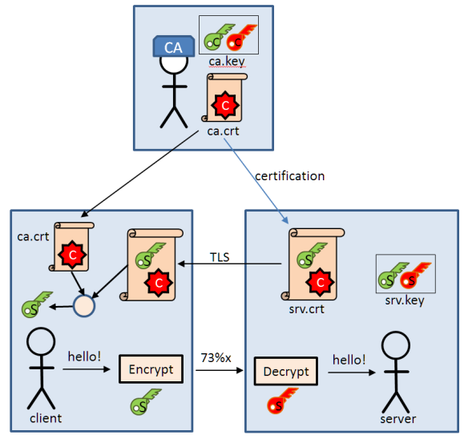

# MQTT & AWS Cloud SetUp and interaction with a iot device project

building an end to end IoT application that ties together several aspects of the MQTT protocol:
- Publish/Subscribe
- Securing the broker
- Making use of the different options of the protocol: QoS, Last will, persistance
using two open source projects from the Eclipse foundation: Mosquito for the broker and Paho for the client library.

## General setup

### Prepare the system

`Action` 
use SSH or connect Raspberrypi to a screen.

- Update and install new packages

Here we are going to install packages in the `apt.txt` (system) and `requirements.txt` for python3

```
# Update lists
sudo apt update -qq
# Upgrade packages
sudo apt upgrade -y
# Install necessary packages
for p in $(cat ./apt.txt); do sudo apt install $p; done
``` 
- Test your installation

These commands should work

```
mosquitto --help
``` 

Use these two commands and get to know how the system and mosquitto are linked

```
# Systemd status 
systemctl status mosquitto.service
# The package installed
dpkg -s mosquitto 
``` 

The `mosquito.service` is under `/usr/lib/systemd/system/mosquitto.service`. 

### Configuration file

```
#Use this command to generate a random value each time
echo $RANDOM
``` 

### Setup of basic auth and more

- Create two users with creadentials in a file named `users.txt`. Use this file in the configuration.
- Use the `mosquitto_passwd` tool to hash the users.txt file to store enrypted info

### Setting up a secure communication for our setup using certificates

This image represents sumary of the infrastructure we are building:



`Credits:` [Erich Styger, "Enable Secure Communication with TLS and the Mosquitto Broker"](https://mcuoneclipse.com/2017/04/14/enable-secure-communication-with-tls-and-the-mosquitto-broker/)

- Create Certification Authority (CA):
 use `openssl` to create an RSA key of 2048 bits with DES3 ciphering. Choose a pass phrase for CA and remember it
```
openssl genrsa -des3 -out ca.key 2048
```
- Create a certificate for CA, using the key from step 1:
This command creates an X509 self-signed certificate that lasts 10 years (3650 days) using our key (with the password). 
```
openssl req -new -x509 -days 3650 -key ca.key -out ca.crt
```
we will be asked to enter a certain number of info on the certificate. This is an example input (note that my machine's name is `prashant-Lenovo-ideapad-530S-14IKB`. You can put your own hostname there):
```
Country Name (2 letter code) [AU]:FR
State or Province Name (full name) [Some-State]:France
Locality Name (eg, city) []:Paris
Organization Name (eg, company) [Internet Widgits Pty Ltd]:ESIEE
Organizational Unit Name (eg, section) []:IT
Common Name (e.g. server FQDN or YOUR name) []:prashant-Lenovo-ideapad-530S-14IKB
Email Address []:prashantdhillon007@gmail.com
```
- Create a private key for the server:
This private key is not password protected. we can choose to protect it with a password, which we should enter when starting the broker.
```
openssl genrsa -out srv.key 2048
```
- Certify this private server key in 2 steps:
    - Step 1: the signing request
    tip: do not use the same info as in the previous certificate generation. See example intputs below the command.
    ```
    openssl req -new -out srv.csr -key srv.key
    ```
    Example inputs in the certificate request.
    ```
    Country Name (2 letter code) [AU]:FR
    State or Province Name (full name) [Some-State]:France
    Locality Name (eg, city) []:Paris
    Organization Name (eg, company) [Internet Widgits Pty Ltd]:Esiee
    Organizational Unit Name (eg, section) []:R&D
    Common Name (e.g. server FQDN or YOUR name) []:prashant-Lenovo-ideapad-530S-14IKB
    Email Address []:prashantdhillon007@gmail.com

    Please enter the following 'extra' attributes
    to be sent with your certificate request
    A challenge password []:spring
    An optional company name []:Esiee 
    ```
    - Step 2: Sign the server request using our CA
    we will be asked to re-enter the password for the certificate we created in step 1
    ```
    openssl x509 -req -in srv.csr -CA ca.crt -CAkey ca.key -CAcreateserial -out srv.crt -days 3650
    ```
we should be having 6 files by now:
```
-rw-r--r-- 1 sofiane sofiane 1,4K mars   1 12:08 ca.crt # CA Certificate
-rw------- 1 sofiane sofiane 1,8K mars   1 12:05 ca.key # CA key pair (private, public)
-rw-r--r-- 1 sofiane sofiane   41 mars   1 12:19 ca.srl # CA serial number file
-rw-r--r-- 1 sofiane sofiane 1,3K mars   1 12:19 srv.crt # server certificate
-rw-r--r-- 1 sofiane sofiane 1,1K mars   1 12:16 srv.csr # certificate sign request, not needed any more
-rw------- 1 sofiane sofiane 1,7K mars   1 12:11 srv.key # server key pair
``` 
To start a broker we'll need the following files: `ca.crt`, `srv.crt`, and `srv.key`. we can create a `certs` folder for them. We will point to this folder later in our mosquitto.conf file
To start a client (publsher, subscriber) we'll need the following file: `ca.crt`. we can put it inside `clients` folder.

- Using our certificates and keys in practice
    - The minimal configuration file for our broker
    ```
    # Config file for mosquitto
    
    port 8883

    cafile ./certs/ca.crt
    certfile ./certs/srv.crt
    keyfile ./certs/srv.key
    tls_version tlsv1.2
    ```
    we can now start the broker: `mosquitto -v -c ./mosquitto.conf`
    - Publish our first message as a client:
    ```
    # Publish
    mosquitto_pub -h prashant-Lenovo-ideapad-530S-14IKB -p 8883 -t test -m $RANDOM --cafile ./clients/ca.crt --tls-version tlsv1.2
    # Subscribe
    mosquitto_sub -h prashant-Lenovo-ideapad-530S-14IKB -p 8883 -t test --cafile ./certs/ca.crt
    ```

- Testing broker configuration and certfications with openssl using this client command. to Use it after starting the broker. Press enter to end the connection.
```
$ openssl s_client -connect localhost:8883 -CAfile ./clients/ca.crt

```

## Writing client program

In this part of the project, we will use the python3 `paho-mqtt` library we installed in the first part and create our own clients to publish and subscribe to the broker. We are only going to use `Python3`.

### Getting to know Paho

- Create you virtual environment and install the libraries there
```
# Virtual environment
python3 -m venv pymqtt
# Activate the environment
source ./pymqtt/bin/activate
# On windows: pymqtt/scripts/activate
# Install python3 libraries
pip3 install -r requirements.txt
```

#### Read Prashant_Project.pdf file in the repo for AWS system and reference
